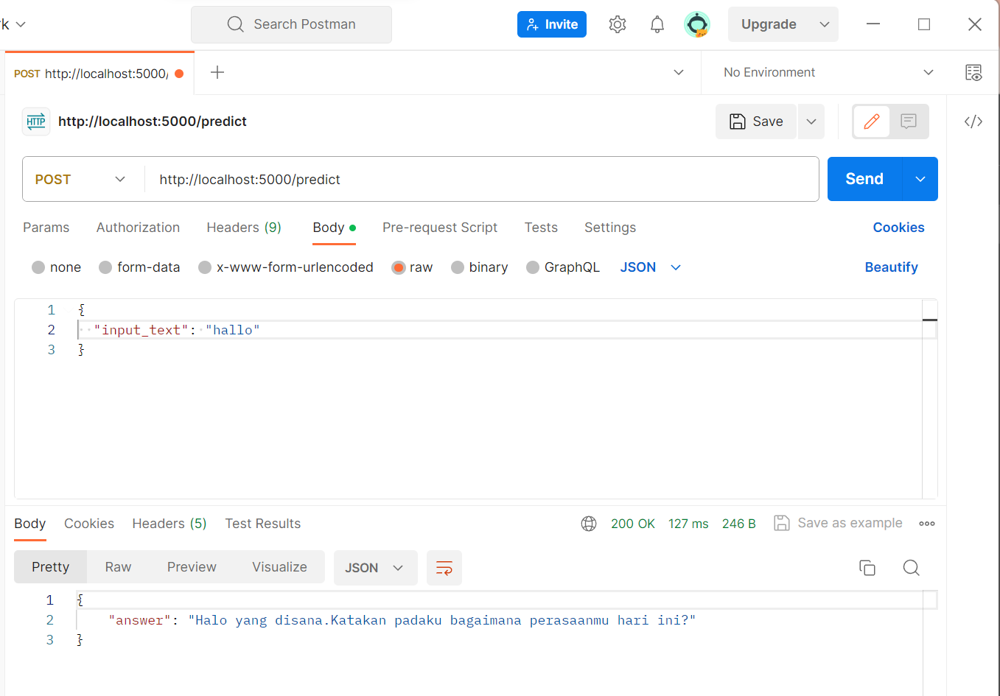
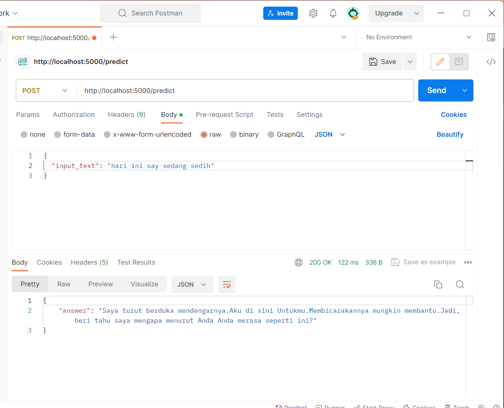
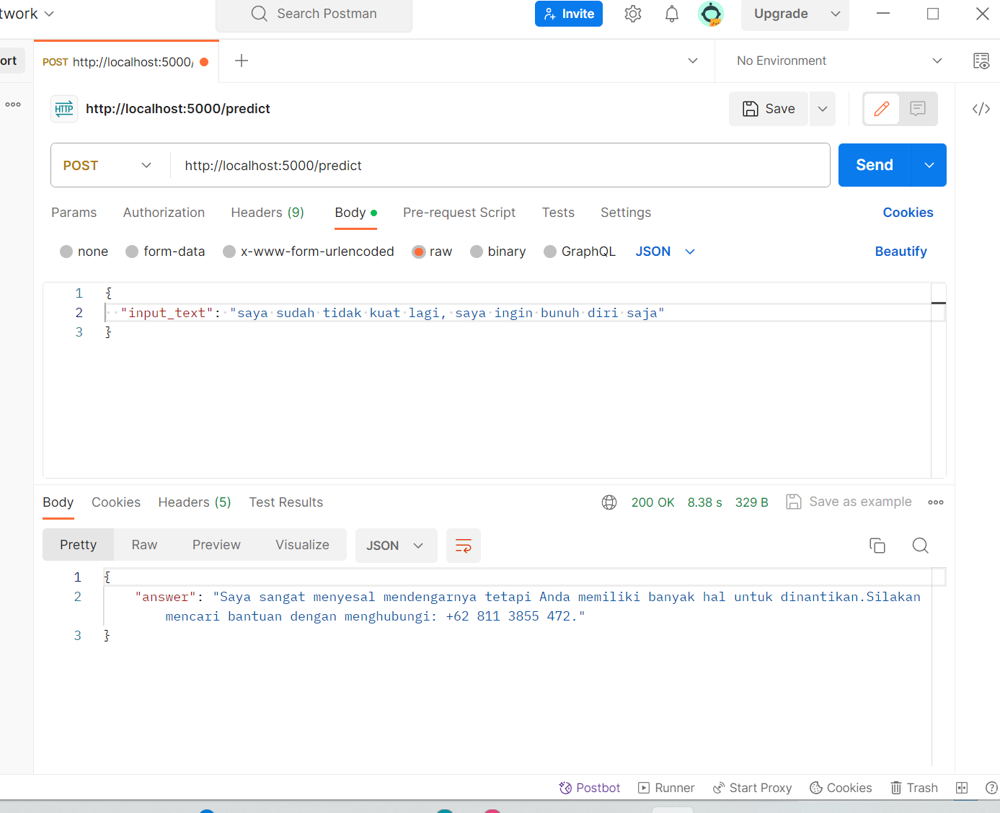

# E-MPAQ
## Mental Health Retieval Chatbot Using Bi-LSTM

This project implements a Mental Health Chatbot leveraging Bidirectional Long Short-Term Memory (BiLSTM) networks. The chatbot is designed to provide support for mental health by engaging in conversations, understanding user emotions, and offering relevant information.

The model in this project was created with reference to the following datasets:
- https://www.kaggle.com/datasets/praveengovi/emotions-dataset-for-nlp/data
- https://www.kaggle.com/datasets/elvis23/mental-health-conversational-data

## Requirement
You MUST install these before Running  this program:
- Python 3.10 or higher
- Tensorflow 2.15.0
- Scikit-learn 1.2.2
- Pandas 2.1.4
- Numpy 1.24.3
- Flask 3.00
  
## CODE & DATASET
[Training Model Code](https://github.com/CH2-PS191/ml-ch2-ps191/blob/main/build_model.ipynb)
<br>
[Dataset](https://github.com/CH2-PS191/ml-ch2-ps191/blob/main/dataset/data_train.csv)


## Deployment

1. Downloads
    ```shell
    $ git https://github.com/CH2-PS191/ml-ch2-ps191.git
    $ cd deployment
    ```
2. Run Flask
    ```shell
    $ python app.py
    ```
3. Acces Via Postman



